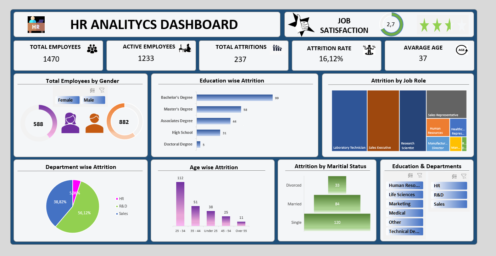
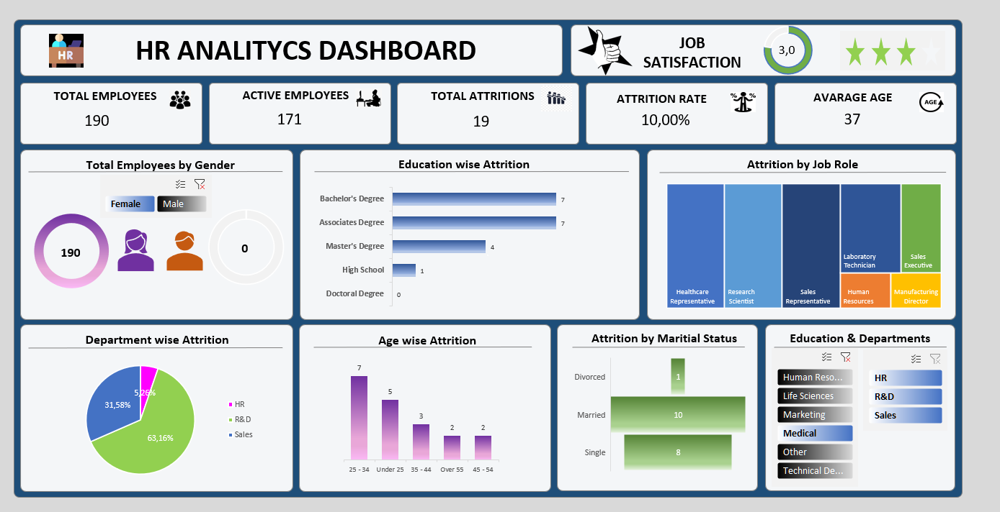

# Employee Attrition Analysis Project

In this Excel project, I conducted a detailed analysis of employee attrition within the company. The primary goal was to gain insights into the factors influencing employee turnover and to present the findings in a clear and visually appealing manner.

## Project Overview

- **Data Cleaning**: I meticulously cleaned the data, ensuring its accuracy and reliability for a robust analysis.
  
- **Exploratory Data Analysis**: Utilizing Excel's powerful features such as pivot tables, pivot charts, and various Key Performance Indicators (KPIs), I examined the impact of factors such as gender, education level, job role, department, age, and marital status on attrition.

- **Attrition Percentages**: In addition to providing an overall view of attrition in terms of absolute numbers, I calculated attrition percentages to provide a more comprehensive understanding.

- **Employee Satisfaction Ratio**: To gauge employee satisfaction, I introduced a satisfaction ratio derived from job satisfaction levels, contributing to a more nuanced analysis.

## Visual Representation

The tools and functionalities in Excel enabled me to present the findings in a visually compelling manner. I utilized charts and graphs to illustrate the patterns and insights derived from the data, making it easier for stakeholders to grasp the key takeaways.

## Conclusion

This project not only shed light on the factors influencing attrition within the company but also highlighted the power of Excel in conducting in-depth workforce analyses.

## Screenshots

A general overview of the project dashboard with no applied filters. It provides fundamental information about the attrition analysis.

Examining the project dashboard for attrition analysis with applied filters, specifically focusing on gender (females) and education field(medical)

